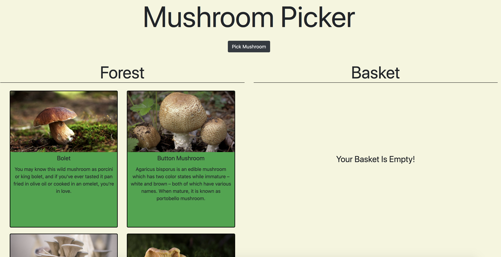
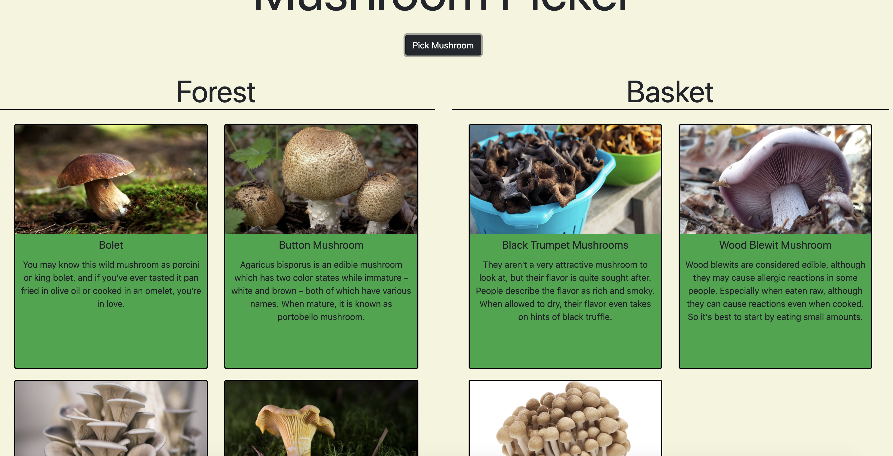
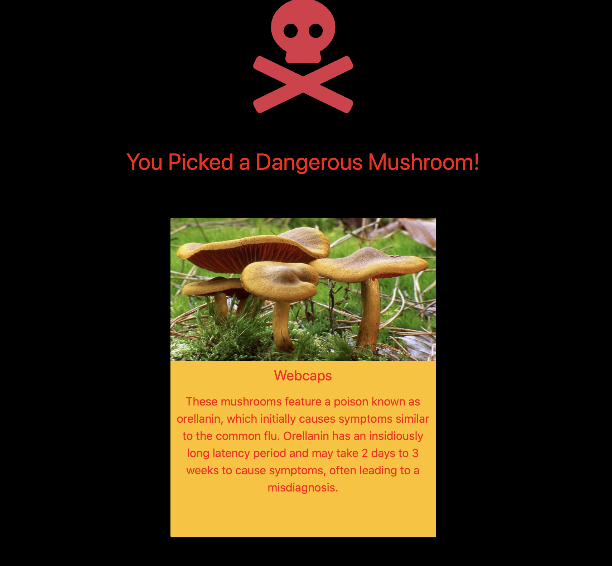
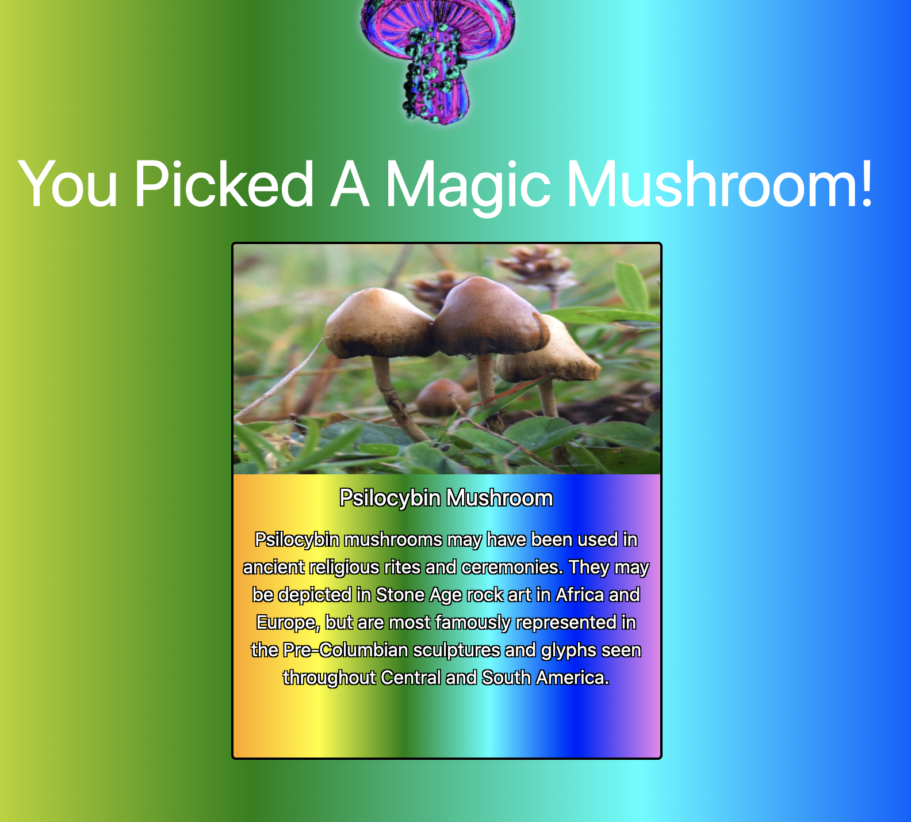

# Description
This project was a first dive into the world of React.  This app allows the user to pick random mushrooms from a forest and place them in their basket, given they are not poisonous or deadly.  If the user happens to pick a poisonous mushroom, they lose two other mushrooms that were in their basket.  If the user picks a deadly one, they lose all of their mushrooms.  

There are two ways the user can win: If they pick every unique type of mushroom that isn't dangerous, or if they pick the magic mushroom, which automatically transfers all unique, non-dangerous mushrooms into their basket.  

The four main components of this app are the "Main" component, which consist of the two sub-components of "Forest" and "Basket", and the "Mushroom" component which is a card component that is rendered by both "Forest" and "Basket".

# Screenshots

# How To Run
1. Clone down this repo
2. Make sure you have http-serve installed via npm. If not, get it HERE.
3. On your command line run hs -p 9999
4. In your browser go to http://localhost:9999